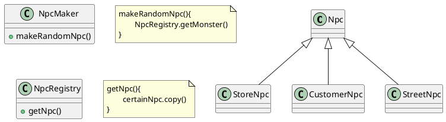

# Prototype Pattern
- 인스턴트를 만드는 것이 자원/시간을 많이 소비하는 경우
- 가지고 있는 instance registry에서 적당한 instance를 copy하여 return
- 인스턴스를 만드는 방법(constructor 및 class 구성 등)을 몰라도 생성 가능
- 복잡하게 얽힌 클래스의 인스턴스를 생성하는데 유용
- 복사하는 것이 더 복잡할 때도 있다(deepcopy가 어려운 경우)

