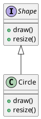
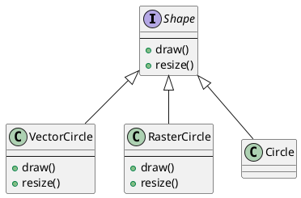
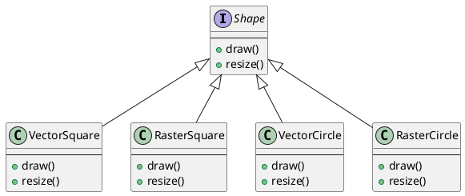
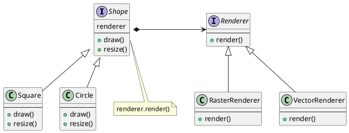

# Bridge Pattern
## 문제 상황
다음과 같이 Circle을 생성하고 draw하는 class를 생각해보자

draw 방식이 여러개가 생긴다면 위의 구조에서는 계속해서 class를 추가해야 할 것이다.

shape의 종류도 계속 추가되어야 한다면 마찬가지로 계속해서 class를 추가해야 할 것이다.

## 해결 방안
문제가 되는 부분은 Shape과 Draw 방식이 계속해서 변경되거나 증가할 수 있다는 것이다. class를 두 부분으로 나눠보자

- 클래스의 구조를 추상 클래스와 구현 클래스 계층구조로 분리한다.
  - 추상 클래스: Client가 사용할 인터페이스
  - 구현 클래스: 실제 기능을 구현한 클래스
  - 추상 클래스는 구현 클래스를 composition으로 구성한다.
- 즉, Shape은 추상클래스, renderer는 구현클래스이다.
- Shape.draw()에서는 renderer.render()를 호출한다.
  
Bridge 패턴은 구현 부분을 interface에 완전히 결합하지 않기 때문에 두 계층구조로 분리할 수 있고 독립적인 확장이 가능하다.
```plantuml
@startuml
interface Shape {
    renderer
    --
    +draw()
    +resize()
}
class Square {
    --
    +draw()
    +resize()
}
class Circle {
    --
    +draw()
    +resize()
}
class Triangle {
    --
    +draw()
    +resize()
}
interface Renderer {
    --
    +render()
}
class RasterRenderer {
    --
    +render()
}
class VectorRenderer {
    --
    +render()
}
class DotRenderer {
    --
    +render()
}
Shape *-> Renderer
Shape <|-- Circle
Shape <|-- Square
Shape <|-- Triangle
Renderer <|-- RasterRenderer
Renderer <|-- VectorRenderer
Renderer <|-- DotRenderer
@enduml