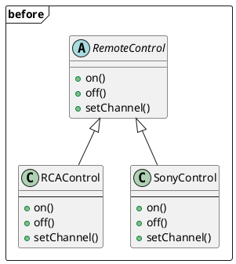
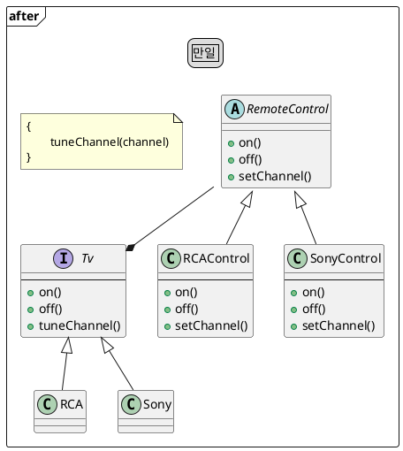

# Bridge Pattern

```plantuml
@startuml
frame "before" {
    abstract RemoteControl1 as "RemoteControl" {
        +on()
        +off()
        +setChannel()
    }

    class RCAControl1 as "RCAControl" {
        --
        +on()
        +off()
        +setChannel()
    }
    class SonyControl1 as "SonyControl" {
        --
        +on()
        +off()
        +setChannel()
    }
    RemoteControl1 <|-- RCAControl1
    RemoteControl1 <|-- SonyControl1
}
@enduml
```

```plantuml
@startuml
frame "after" {
    abstract RemoteControl2 as "RemoteControl" {
        +on()
        +off()
        +setChannel()
    }
    interface Tv {
        --
        +on()
        +off()
        +tuneChannel()
    }

    class RCAControl2 as "RCAControl" {
        --
        +on()
        +off()
        +setChannel()
    }
    class SonyControl2 as "SonyControl" {
        --
        +on()
        +off()
        +setChannel()
    }
    note "{\n\ttuneChannel(channel)\n}" as n1


    RemoteControl2::implementor --* Tv
    RemoteControl2 <|-- RCAControl2
    RemoteControl2 <|-- SonyControl2
    Tv <|-- RCA
    Tv <|-- Sony
    legend
    |만일 |
    endlegend
}
@enduml
```