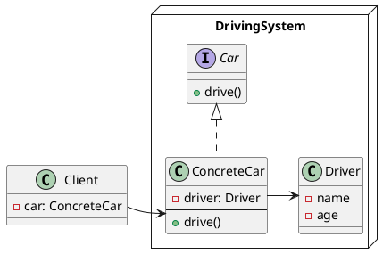
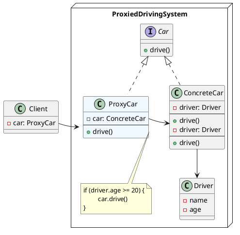

# Proxy Pattern

## Proxy vs. Decorator
- Proxy는 원래 class와 같은 interface; Decorator는 feature added interface
- Decorator는 원래 class의 instance를 member변수로 가지고 있다.(injected when constructor is called)
- Proxy는 원래의 class를 refrence하고 있을 수도 있고 아닐 수도 있음(다른 방식으로 call을 전달할 수도 있다.)